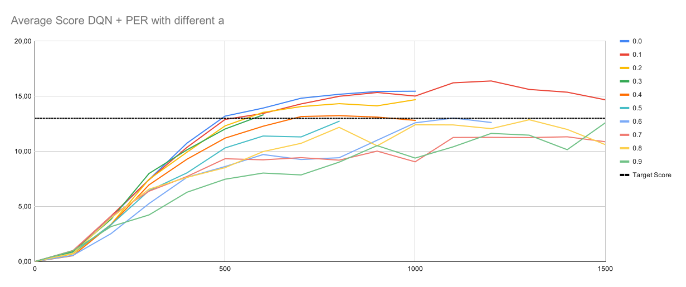
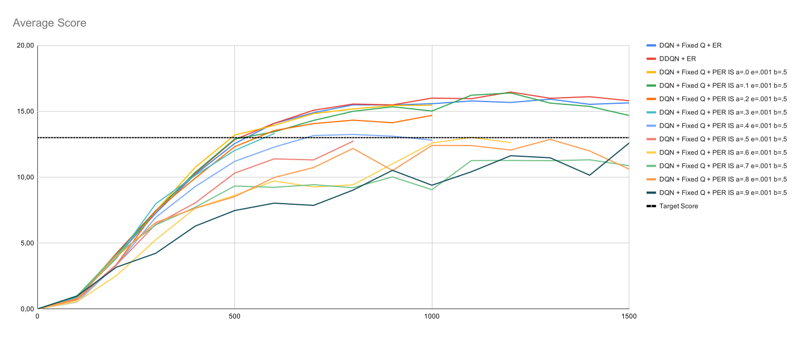

# Training an agent with deep Q-learning

Goal of this project was to train an agent to handle the environment without the agent knowing anything about the environment. It should run until it reached a terminal state (in this environment after doing 300 moves) and score as high as possible.

A neural network is used to train the agent. The network is fed with the state and outputs an estimation of the Q-action-value to determine which action might deliver the best result.
Because a DQN only based on a neural network with backpropagation alone would result in very unstable results two features are added to stabilize the outcome:

**Experience Replay**

When we train an agent there is a risk of always getting the same experiences in the same or similar order. So if we would learn after every step this might result in very one-sided learning due to the correlations of those experiences. Also it might give rare experiences not enough weight and since we only learned it once, we might miss to learn how to handle it right.

To solve this experience replay introduces a replay buffer. Every experience is stored inside the replay buffer and we learn every x actions (in our case 4) a sample of random experiences from this buffer. This way we break the correlation between those experiences and also increase the chance of seeing a rare experience more than once.

An improvment of this would be Prioritized Experience Replay which samples the learn batch randomly with propabilites based on the last know TD error of the experience. This increases the chance to learn from a experience with a high TD error which should be of more value to us.

**Fixed Q-Targets**

In Q-learning we never know what the best result is. Normal Q-learning stores the Q-action-values in a dictionary for each combination of states and actions. So changing one Q-action-value does not affect any other values. But a deep Q-Network (DQN) uses a function approximation to estimate the Q-action-values. So there migh be some correlations that have a negativ effect on our result. 

To avoid those correlations Fixed Q-Targets adds another network which gets soft updates with the factor of &tau; from the main network and is used to reprensent the expected Q-action value when determining our TD error.

## Setup

### Neural Network Layout

The network used consists of one input layer, two hidden layers with ReLU action function and one output layer ([code](./model.py)).

| Layer  | Neurons  | Out | Activation |
|--------|----:|----:|------------|
| Input |  37  | &nbsp;       |
| fully connected |  64 | ReLU       |
| fully connected |  64 | ReLU       |
| fully connected |   4 | &nbsp;     |

### Parameters
#### Experience Replay
| Parameter     | Value | Description |
|---------------|-------:|---|
| Buffer size   | 10000 | amount of entries in 'memory'
| Batch size    |    64 | amount of memory entries that are taken for each learn step
| update every x turns | 4 | not learning every turn, but all x turns

#### DQN parameter
| Parameter | Value | Description |
|-----------|-------:| ---|
| learning rate | 0.0005 | learning rate
| &tau; | 0.003 | used by Double DQN and fixed Q-targets for softupdates of the 2nd network
| &gamma; | 0.99 | discount factor for valuing future rewards
| &epsilon; start | 1.0 | initial value for &epislin; which is the percent chance to take a random action instead of best current action
| &epsilon; decay | 0.995 | factor by which &epsilon; is reduced after each episode
| &epsilon; minimal | 0.01 | minimal &epsilon; so that there is always a minimal random part

## Training

The agent has been trained with a deep Q-network (DQN) with experience replay (ER) until it reached an average score of +13 over 100 consecutive episodes as required by the udacity nanodegree.

My data is based on 11 runs with 1500 episodes. The result was that the agent declared on average in episode 534 that he solved the environment and improved further until around episode 800 where he started to fluctuate between an average of 15.5 and 16.0. 
With small experiments with the hyperparameters it has shown that the initial parameters like used in previous lessons were quite optimal. [Code](./dqn_agent.py) 

### Alternate approaches
#### DDQN
I also tried a double deep Q-network (DDQN) with experience replay (ER) to check how it would perform in comparison. On Average the agent solved the environment in episode 496 and also and had a bit higher scores. He also started to fluctuate in episode 800 but with slightly higher score between 15.5 and 16.5. For those data i made 5 runs with 1500 episodes.

Also i have recognized that the variance over all runs is lower for the DDQN so it seems to be more reliable, but to be certain i would need to do some more runs to get more reliable data.  [Code](./ddqn_agent.py)

#### DQN + PER
As last step i tried to implement a DQN with prioritized experience replay (PER) as far as i understood it from the udacity lessons. I implemented an O(n) version, but the results were not as good as i hoped.

I had choosen a &beta; of 0.5, because i had no idea what might be a good value and i tried to change the &alpha; to improve the results, but the further i increased the value away from 0.0 and to 1.0 the worse the results got and sometimes didn't even solve the environment. The best results were with &alpha; 0.0 which on average solved the environment in episode 483. [Code](./dqn_per_agent.py) 

## Data
Stored weights from the DQN run can be found at [checkpoint_trained_519_episodes.pth](./weights/checkpoint_trained_519_episodes.pth) and other solved values can be found in the [weights](./weights) folder.

Datas of my testruns can be found at https://docs.google.com/spreadsheets/d/1eUB7RycHVyyxyvEqwnS6_q2bdTcYS8Fv6HvPdg88EAw

## Future improvements
For future improvements i would like to take more runs per agent to make sure that my interpretations are right and not some random fluctuations. I also would like to test more hyperparameter changes especially &alpha; and &beta; with PER.

Also since DDQN and DQN+PER both resulted in an earlier average solve episode it might be worth to try a combination of both for further improvements.

Also i would like to refactor my DDQN because this is my first project in python and i didn't get some lines working as i would like them to have, so some implementations are more a working than a performant or good looking version.
