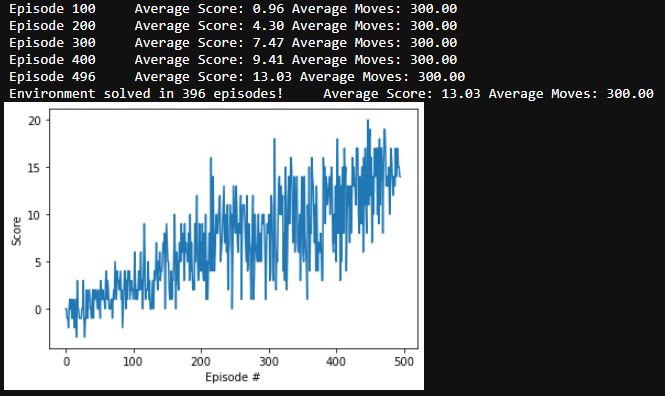

# Training an agent with deep Q-learning

* [Neural Network Layout](#layout)
* [Training](#training)
* [Future improvements](#future_improvements)

<a name="layout" />
## Neural Network Layout

The layout of all agents used is the same and as described below, the code can be found [here](./model.py)

| Layer  | In | Out | Activation |
|--------|----|----:|------------|
| Linear | 37 | 64  | RELU       |
| Linear | 64 | 64  | RELU       |
| Linear | 64 |  4  | &nbsp;     |

<a name="training" />
## Training

The agent has been trained with a double deep q-network with memory replay until it reached a average score of +13 over 100 consecutive episodes as required by the udacity nanodegree.

### Parameters

| Parameter | Value |
|-----------|-------:|
| Buffer size | 10000 |
| Batch size | 64 |
| gamma | 0.99 |
| tau | 0.003 |
| learning rate | 0,0005 |
| update every x turns | 4 |
| start epsilon | 1.0 |
| minimal epsilon | 0.0 |
| epsilon decay | 0.995 |

Optimizer = Adam

### Training progress

### Trained weights
Stored weights can be found at [ddqn_trained_496.pth](ddqn_trained_496.pth)

<a name="future_improvements" />
## Future improvements

